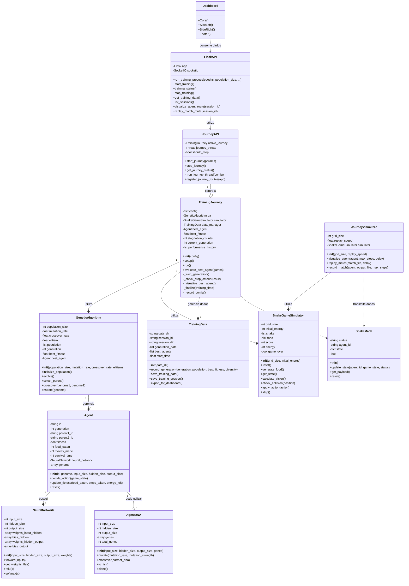

# Diagrama de Classes - Snake Genetic Algorithm

## Descrição das Classes Principais

### Core do Sistema

- **SnakeGameSimulator**: Responsável pela simulação do ambiente do jogo da cobra
- **Agent**: Representa um agente controlado por IA no jogo
- **NeuralNetwork**: Implementa a rede neural usada para tomada de decisões
- **AgentDNA**: Representa o genoma (pesos) de um agente para evolução genética
- **GeneticAlgorithm**: Implementa o algoritmo genético para evoluir a população de agentes
- **SnakeMach**: Transmite dados em tempo real para visualização
- **TrainingData**: Gerencia o armazenamento e exportação de dados de treinamento

### Jornada de Treinamento

- **TrainingJourney**: Gerencia o ciclo completo de treinamento, desde a configuração até avaliação
- **JourneyVisualizer**: Visualiza agentes em ação, permite replay de partidas salvas

### API e Interface

- **JourneyAPI**: Expõe funcionalidades da jornada para a aplicação web
- **FlaskAPI**: Implementa endpoints REST para controle do sistema

### Dashboard

- **Dashboard**: Interface visual para monitorar e controlar o treinamento
  - Contém componentes como Core, SideLeft, SideRight e Footer

## Relacionamentos Principais

- Um **Agent** possui uma **NeuralNetwork** para tomada de decisões
- Um **GeneticAlgorithm** gerencia múltiplos **Agent**
- A **TrainingJourney** utiliza **GeneticAlgorithm**, **SnakeGameSimulator** e **TrainingData**
- O **JourneyVisualizer** transmite dados via **SnakeMach**
- A **FlaskAPI** controla a **JourneyAPI** que por sua vez controla a **TrainingJourney**
- O **Dashboard** consome dados da **FlaskAPI**

Este diagrama de classes representa a arquitetura completa do sistema, mostrando tanto os componentes de backend (simulação, algoritmo genético) quanto os componentes de frontend (dashboard, visualização).
