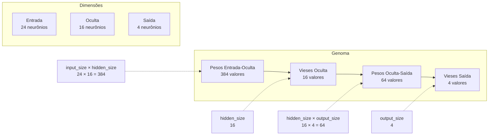
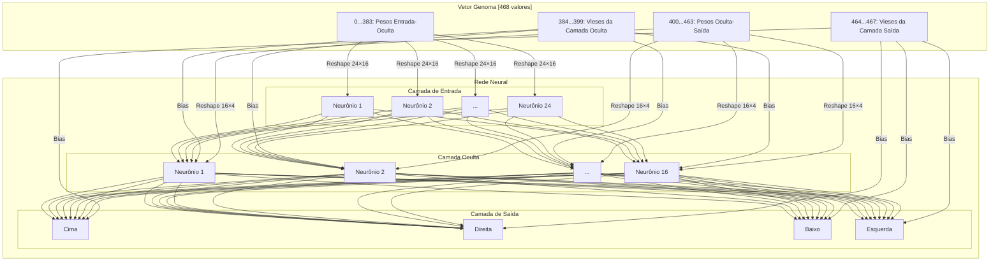
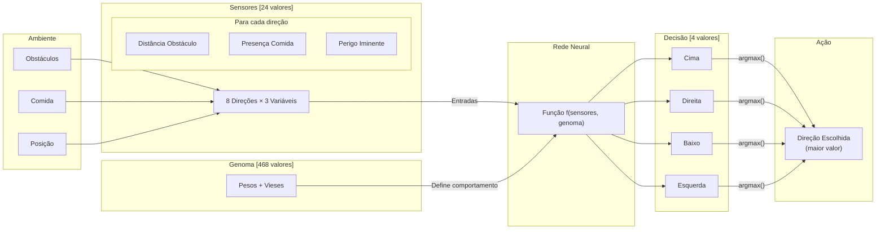
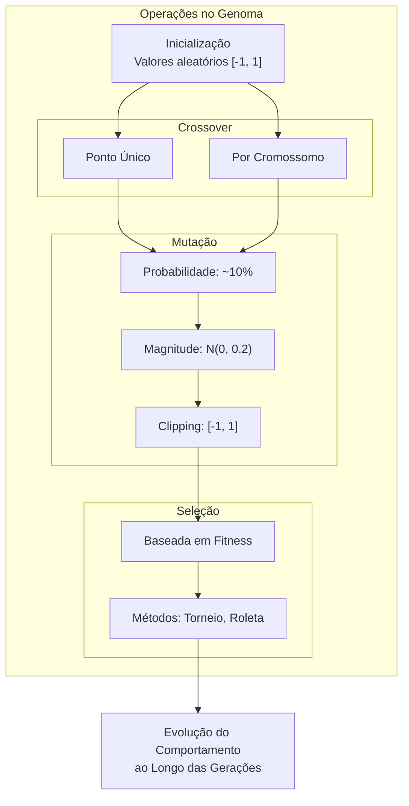
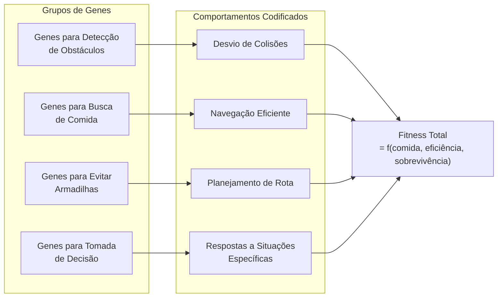

# Genoma no Algoritmo Genético do Snake

## Conceito de Genoma em Algoritmos Genéticos

No contexto de algoritmos genéticos, um **genoma** é a representação completa das características hereditárias de um indivíduo. Inspirado na biologia, onde o DNA contém as instruções genéticas para o desenvolvimento e funcionamento de todos os organismos vivos, o genoma em algoritmos genéticos define completamente um agente e seu comportamento.

## Implementação do Genoma no Projeto

### Estrutura do Genoma

No projeto de IA para o jogo Snake, o genoma é implementado como um vetor contínuo de valores reais (tipicamente no intervalo [-1, 1]) que codifica todos os pesos e vieses da rede neural do agente. Esta representação permite:

1. **Herança genética**: Transmissão de características entre gerações
2. **Variação**: Mutação para explorar novas possibilidades
3. **Recombinação**: Crossover para combinar características de diferentes agentes

### Mapeamento do Genoma para a Rede Neural

Cada agente possui uma rede neural que traduz informações do ambiente (entradas) em decisões de movimento (saídas). O genoma define completamente esta rede neural através da seguinte estrutura:

```
[W_ih][B_h][W_ho][B_o]
```

Onde:
- **W_ih**: Matriz de pesos entre a camada de entrada e a camada oculta
- **B_h**: Vetor de vieses da camada oculta
- **W_ho**: Matriz de pesos entre a camada oculta e a camada de saída
- **B_o**: Vetor de vieses da camada de saída

Para uma rede com:
- `input_size` neurônios na camada de entrada (24 por padrão)
- `hidden_size` neurônios na camada oculta (16 por padrão)
- `output_size` neurônios na camada de saída (4 por padrão)

O tamanho total do genoma é:
```
total_weights = (input_size * hidden_size) + hidden_size + (hidden_size * output_size) + output_size
```

Na configuração padrão, temos:
```
total_weights = (24 * 16) + 16 + (16 * 4) + 4 = 384 + 16 + 64 + 4 = 468 valores
```

### Significado Biológico dos Componentes

1. **Pesos entre camadas (W_ih, W_ho)**:
   - Análogos às conexões sinápticas no cérebro
   - Determinam a influência relativa de cada característica na tomada de decisão
   - Valores positivos indicam excitação, valores negativos indicam inibição

2. **Vieses (B_h, B_o)**:
   - Análogos ao limiar de ativação dos neurônios
   - Determinam a tendência básica de ativação de cada neurônio
   - Permitem ajustar o comportamento padrão do agente

## Características Codificadas no Genoma

O genoma codifica indiretamente as seguintes características comportamentais do agente:

### 1. Sensibilidade aos Estímulos

Os pesos relacionados às entradas sensoriais determinam como o agente responde a diferentes estímulos:

- **Distância até obstáculos**: Quanto o agente se preocupa em evitar colisões
- **Localização da comida**: Como o agente prioriza se mover em direção à comida
- **Perigo iminente**: Resposta a situações de risco elevado

### 2. Estratégias de Movimento

Através dos pesos e conexões, o genoma define estratégias como:

- **Exploração vs. Exploração**: Equilíbrio entre buscar novas áreas ou aproveitar recursos conhecidos
- **Planejamento de caminho**: Capacidade de planejar rotas eficientes para a comida
- **Comportamento evasivo**: Habilidade de evitar situações sem saída

### 3. Memória Implícita

Embora a rede neural implementada seja feed-forward sem memória explícita, certos padrões de pesos podem criar:

- **Tendências de movimento**: Preferência por determinadas direções ou padrões
- **Resposta a configurações específicas**: Reconhecimento implícito de situações comuns

## Operações Genéticas

### Inicialização

O genoma inicial é gerado aleatoriamente (distribuição uniforme no intervalo [-1, 1]), criando agentes com comportamentos iniciais diversos.

### Crossover (Recombinação)

O crossover combina genomas de dois agentes "pais" para criar um novo agente "filho":

1. **Crossover de Ponto Único**: Seleciona um ponto aleatório no genoma e combina a primeira parte de um pai com a segunda parte do outro
2. **Crossover por Cromossomo**: Nas implementações mais avançadas, seleciona grupos inteiros de pesos (correspondentes a camadas específicas) de cada pai

### Mutação

A mutação introduz pequenas variações aleatórias no genoma:

1. **Taxa de Mutação**: Probabilidade de cada gene ser mutado (tipicamente 0.1 ou 10%)
2. **Força da Mutação**: Magnitude da variação quando ocorre uma mutação (tipicamente distribuição normal com σ = 0.2)
3. **Clipping**: Os valores são mantidos no intervalo [-1, 1] para garantir estabilidade

## Expressão do Genoma

O genoma é "expresso" quando:

1. É carregado na rede neural do agente
2. A rede neural processa as entradas sensoriais
3. As saídas da rede determinam a ação (direção de movimento) do agente

## Avaliação do Fitness (Aptidão)

O sucesso do genoma é avaliado através do desempenho do agente no jogo:

1. **Pontuação primária**: Quantidade de comida consumida (principal objetivo)
2. **Eficiência energética**: Relação entre energia restante e passos realizados
3. **Tempo de sobrevivência**: Capacidade de evitar a morte por período prolongado

## Implementação Técnica

No código, o genoma é gerenciado através das seguintes classes:

1. `AgentGene`: Representa uma parte funcional do genoma (ex: pesos entre camadas específicas)
2. `AgentDNA`: Gerencia o genoma completo, incluindo operações de crossover e mutação
3. `Agent`: Contém o genoma e a rede neural associada, aplicando o comportamento codificado

## Conclusão

O genoma no algoritmo genético do Snake é uma representação numérica completa do comportamento do agente, codificando os pesos e vieses da rede neural que traduz percepções em ações. Através de operações de seleção, crossover e mutação, o algoritmo evolui populações de agentes cada vez mais adaptados ao desafio de maximizar pontuação no jogo enquanto evita colisões.

Esta abordagem demonstra o poder dos algoritmos genéticos em desenvolver soluções eficazes para problemas complexos de tomada de decisão, sem necessidade de programação explícita do comportamento desejado.

# Diagramas do Genoma do Agente Snake

Este documento contém diagramas que ilustram a estrutura do genoma do agente Snake e como ele se relaciona com a rede neural.

## 1. Estrutura do Genoma



## 2. Mapeamento do Vetor para a Rede Neural



## 3. Fluxo de Informação: Do Ambiente à Decisão



## 4. Operações Genéticas



## 5. Expressão dos Genes - Comportamentos Específicos



