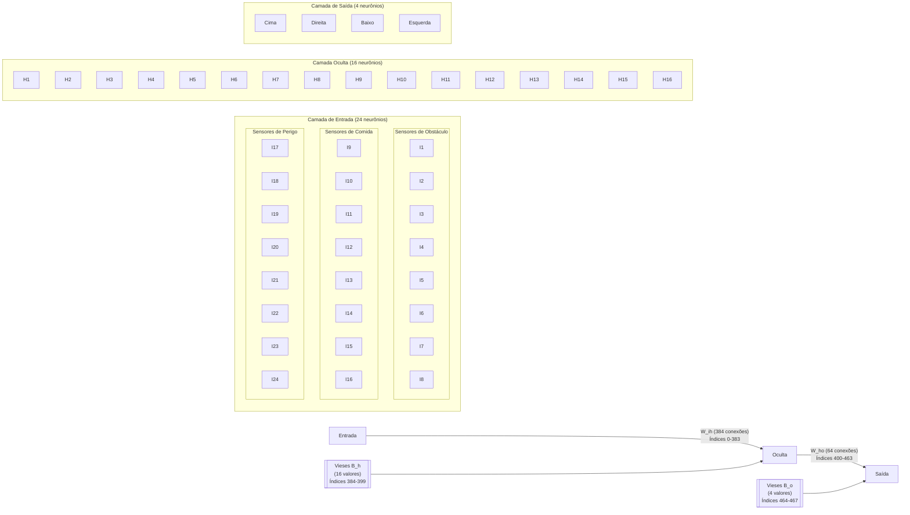
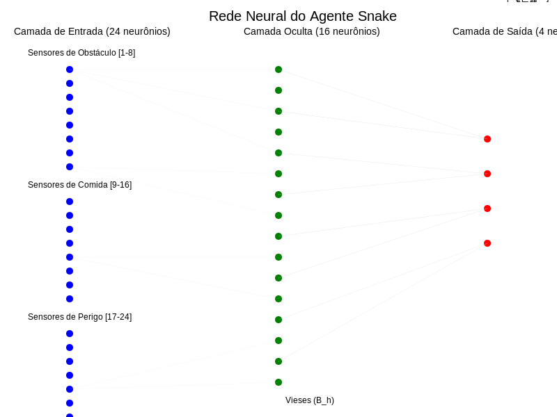

 
🧠 Estrutura da Rede Neural

 

[Entradas] → [Camada Oculta] → [Saídas]

📥 Camada de Entrada

 

Direção atual da cobra:  

Posição relativa da comida:  

Perigos nas direções:  


 

🧩 Camadas Ocultas

 

📤 Camada de Saída

 

🧬 Representação Genética

 

🧠 Visualização da Rede Neural

 

 


Fonte: ResearchGate

🔄 Integração com o Agente

 

Se desejar, posso auxiliar na criação de uma visualização personalizada da rede neural do agente ou fornecer mais detalhes sobre sua implementação.


---

## Arquitetura da Rede Neural do Agente Snake

A rede neural do agente Snake possui uma arquitetura de três camadas:

```
[CAMADA DE ENTRADA] --> [CAMADA OCULTA] --> [CAMADA DE SAÍDA]
    (24 sensores)        (16 neurônios)       (4 neurônios)
```

### Detalhamento da Estrutura

**Camada de Entrada (24 sensores)**:
- Divididos em 3 grupos funcionais:
  * Sensores de Obstáculo: detectam paredes e próprio corpo
  * Sensores de Comida: localizam alimento no ambiente
  * Sensores de Perigo: identificam situações arriscadas

**Camada Oculta (16 neurônios)**:
- Cada neurônio recebe conexões de todos os 24 sensores
- Processam e combinam as informações sensoriais
- Possuem vieses (B_h) que funcionam como "configurações de personalidade"

**Camada de Saída (4 neurônios)**:
- Representam as direções possíveis: Cima, Direita, Baixo, Esquerda
- Cada neurônio recebe conexões de todos os 16 neurônios da camada oculta
- Possuem vieses (B_o) que estabelecem preferências direcionais básicas

### Conexões e Pesos

**Conexões Entrada-Oculta (W_ih)**:
- Total de 384 conexões (24×16)
- Índices 0-383 no genoma
- Determinam como o agente processa informações sensoriais

**Vieses da Camada Oculta (B_h)**:
- 16 valores (um para cada neurônio oculto)
- Índices 384-399 no genoma
- Definem limiares de ativação e tendências comportamentais

**Conexões Oculta-Saída (W_ho)**:
- Total de 64 conexões (16×4)
- Índices 400-463 no genoma
- Determinam como o processamento se traduz em decisões de movimento

**Vieses da Camada de Saída (B_o)**:
- 4 valores (um para cada direção)
- Índices 464-467 no genoma
- Estabelecem preferências direcionais básicas

### Fluxo de Processamento

1. Os 24 sensores captam informações do ambiente
2. Essas informações são ponderadas pelos pesos W_ih (0-383)
3. Os 16 neurônios da camada oculta processam as entradas, aplicando seus vieses B_h (384-399)
4. O resultado do processamento é transmitido para a camada de saída através dos pesos W_ho (400-463)
5. Os 4 neurônios de saída, com seus vieses B_o (464-467), produzem valores de ativação
6. A direção com maior valor de ativação é escolhida como próximo movimento do agente

O genoma completo do agente é composto por 468 valores que codificam todos esses pesos e vieses, determinando seu comportamento e estratégia de jogo[1].

Citações:
[1] GENOMA_CARACTERISTICAS.md https://github.com/govinda777/poc_genetic_algorithms/blob/main/GENOMA_CARACTERISTICAS.md
[2] ga%2Fsnake_nn.py https://github.com/govinda777/poc_genetic_algorithms/blob/main/ga%2Fsnake_nn.py
[3] govind https://github.com/govind

