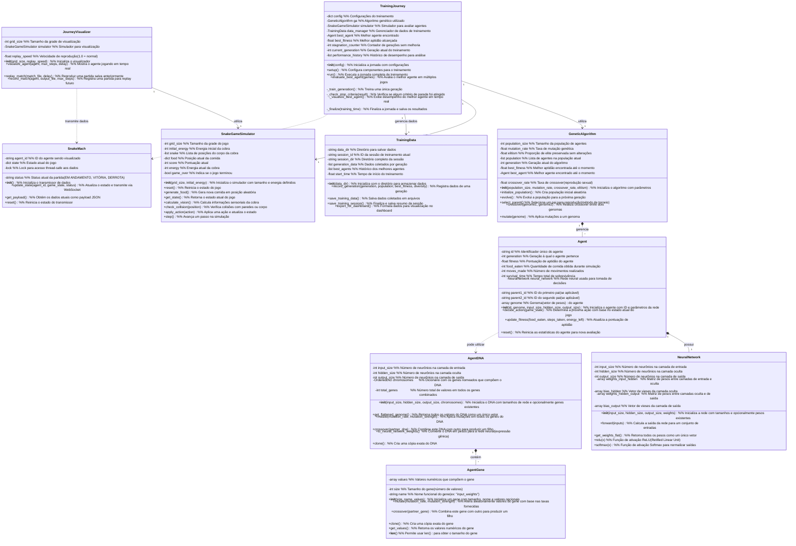

```mermaid
classDiagram
    %% Classes do modelo genético
    class AgentGene {
        -int size                     %% Tamanho do gene (número de valores)
        -string name                  %% Nome funcional do gene (ex: "input_weights")
        -array values                 %% Valores numéricos que compõem o gene
        
        +__init__(size, name, values) %% Inicializa um gene com tamanho, nome e valores opcionais
        +mutate(mutation_rate, mutation_strength) %% Altera aleatoriamente valores do gene com base nas taxas fornecidas
        +crossover(partner_gene)      %% Combina este gene com outro para produzir um filho
        +clone()                      %% Cria uma cópia exata do gene
        +get_values()                 %% Retorna os valores numéricos do gene
        +__len__()                    %% Permite usar len() para obter o tamanho do gene
    }

    class AgentDNA {
        -int input_size               %% Número de neurônios na camada de entrada
        -int hidden_size              %% Número de neurônios na camada oculta
        -int output_size              %% Número de neurônios na camada de saída
        -OrderedDict chromosomes      %% Dicionário com os genes nomeados que compõem o DNA
        -int total_genes              %% Número total de valores em todos os genes combinados
        
        +__init__(input_size, hidden_size, output_size, chromosomes) %% Inicializa o DNA com tamanhos de rede e opcionalmente genes existentes
        +get_flattened_genome()       %% Retorna todos os valores do DNA como um único vetor
        +mutate(mutation_rate, mutation_strength) %% Aplica mutações em todos os genes do DNA
        +crossover(partner_dna)       %% Combina este DNA com outro para produzir um filho
        +to_neural_network_weights()  %% Converte o DNA em pesos para a rede neural (expressão gênica)
        +clone()                      %% Cria uma cópia exata do DNA
    }

    %% Classes do agente e rede neural
    class NeuralNetwork {
        -int input_size               %% Número de neurônios na camada de entrada
        -int hidden_size              %% Número de neurônios na camada oculta
        -int output_size              %% Número de neurônios na camada de saída
        -array weights_input_hidden   %% Matriz de pesos entre camadas de entrada e oculta
        -array bias_hidden            %% Vetor de vieses da camada oculta
        -array weights_hidden_output  %% Matriz de pesos entre camadas oculta e de saída
        -array bias_output            %% Vetor de vieses da camada de saída
        
        +__init__(input_size, hidden_size, output_size, weights) %% Inicializa a rede com tamanhos e opcionalmente pesos existentes
        +forward(inputs)              %% Calcula a saída da rede para um conjunto de entradas
        +get_weights_flat()           %% Retorna todos os pesos como um único vetor
        +relu(x)                      %% Função de ativação ReLU (Retified Linear Unit)
        +softmax(x)                   %% Função de ativação Softmax para normalizar saídas
    }

    class Agent {
        -string id                    %% Identificador único do agente
        -int generation               %% Geração à qual o agente pertence
        -string parent1_id            %% ID do primeiro pai (se aplicável)
        -string parent2_id            %% ID do segundo pai (se aplicável)
        -float fitness                %% Pontuação de aptidão do agente
        -int food_eaten               %% Quantidade de comida obtida durante simulação
        -int moves_made               %% Número de movimentos realizados
        -int survival_time            %% Tempo total de sobrevivência
        -NeuralNetwork neural_network %% Rede neural usada para tomada de decisões
        -array genome                 %% Genoma (vetor de pesos) do agente
        
        +__init__(id, genome, input_size, hidden_size, output_size) %% Inicializa o agente com ID e parâmetros da rede
        +decide_action(game_state)    %% Determina a próxima ação com base no estado atual do jogo
        +update_fitness(food_eaten, steps_taken, energy_left) %% Atualiza a pontuação de aptidão
        +reset()                      %% Reinicia as estatísticas do agente para nova avaliação
    }

    %% Classes do ambiente e simulação
    class SnakeGameSimulator {
        -int grid_size                %% Tamanho da grade do jogo
        -int initial_energy           %% Energia inicial da cobra
        -list snake                   %% Lista de posições do corpo da cobra
        -dict food                    %% Posição atual da comida
        -int score                    %% Pontuação atual
        -int energy                   %% Energia atual da cobra
        -bool game_over               %% Indica se o jogo terminou
        
        +__init__(grid_size, initial_energy) %% Inicializa o simulador com tamanho e energia definidos
        +reset()                      %% Reinicia o estado do jogo
        +generate_food()              %% Gera nova comida em posição aleatória
        +get_state()                  %% Retorna o estado atual do jogo
        +calculate_vision()           %% Calcula informações sensoriais da cobra
        +check_collision(position)    %% Verifica colisões com paredes ou corpo
        +apply_action(action)         %% Aplica uma ação e atualiza o estado
        +step()                       %% Avança um passo na simulação
    }

    %% Classes do algoritmo genético
    class GeneticAlgorithm {
        -int population_size          %% Tamanho da população de agentes
        -float mutation_rate          %% Taxa de mutação genética
        -float crossover_rate         %% Taxa de crossover (reprodução sexual)
        -float elitism                %% Proporção de elite preservada sem alterações
        -list population              %% Lista de agentes na população atual
        -int generation               %% Geração atual do algoritmo
        -float best_fitness           %% Melhor aptidão encontrada até o momento
        -Agent best_agent             %% Melhor agente encontrado até o momento
        
        +__init__(population_size, mutation_rate, crossover_rate, elitism) %% Inicializa o algoritmo com parâmetros
        +initialize_population()      %% Cria população inicial aleatória
        +evolve()                     %% Evolui a população para a próxima geração
        +select_parent()              %% Seleciona um pai para reprodução (método de torneio)
        +crossover(genome1, genome2)  %% Realiza crossover entre dois genomas
        +mutate(genome)               %% Aplica mutações a um genoma
    }

    %% Classes de transmissão e armazenamento de dados
    class SnakeMach {
        -string status                %% Status atual da partida (EM ANDAMENTO, VITÓRIA, DERROTA)
        -string agent_id              %% ID do agente sendo visualizado
        -dict state                   %% Estado atual do jogo
        -lock                         %% Lock para acesso thread-safe aos dados
        
        +__init__()                   %% Inicializa o transmissor de dados
        +update_state(agent_id, game_state, status) %% Atualiza o estado e transmite via WebSocket
        +get_payload()                %% Obtém os dados atuais como payload JSON
        +reset()                      %% Reinicia o estado do transmissor
    }

    class TrainingData {
        -string data_dir              %% Diretório para salvar dados
        -string session_id            %% ID da sessão de treinamento atual
        -string session_dir           %% Diretório completo da sessão
        -list generation_data         %% Dados coletados por geração
        -list best_agents             %% Histórico dos melhores agentes
        -float start_time             %% Tempo de início do treinamento
        
        +__init__(data_dir)           %% Inicializa com o diretório para armazenar dados
        +record_generation(generation, population, best_fitness, diversity) %% Registra dados de uma geração
        +save_training_data()         %% Salva dados coletados em arquivos
        +save_training_session()      %% Finaliza e salva resumo da sessão
        +export_for_dashboard()       %% Formata dados para visualização no dashboard
    }

    %% Classes da jornada de treinamento
    class TrainingJourney {
        -dict config                  %% Configurações do treinamento
        -GeneticAlgorithm ga          %% Algoritmo genético utilizado
        -SnakeGameSimulator simulator %% Simulador para avaliar agentes
        -TrainingData data_manager    %% Gerenciador de dados de treinamento
        -Agent best_agent             %% Melhor agente encontrado
        -float best_fitness           %% Melhor aptidão alcançada
        -int stagnation_counter       %% Contador de gerações sem melhoria
        -int current_generation       %% Geração atual do treinamento
        -list performance_history     %% Histórico de desempenho para análise
        
        +__init__(config)             %% Inicializa a jornada com configurações
        +setup()                      %% Configura componentes para o treinamento
        +run()                        %% Executa a jornada completa de treinamento
        +evaluate_best_agent(games)   %% Avalia o melhor agente em múltiplos jogos
        -_train_generation()          %% Treina uma única geração
        -_check_stop_criteria(result) %% Verifica se algum critério de parada foi atingido
        -_visualize_best_agent()      %% Exibe desempenho do melhor agente em tempo real
        -_finalize(training_time)     %% Finaliza a jornada e salva os resultados
    }

    class JourneyVisualizer {
        -int grid_size                %% Tamanho da grade de visualização
        -float replay_speed           %% Velocidade de reprodução (1.0 = normal)
        -SnakeGameSimulator simulator %% Simulador para visualização
        
        +__init__(grid_size, replay_speed) %% Inicializa o visualizador
        +visualize_agent(agent, max_steps, delay) %% Mostra o agente jogando em tempo real
        +replay_match(match_file, delay) %% Reproduz uma partida salva anteriormente
        +record_match(agent, output_file, max_steps) %% Registra uma partida para replay futuro
    }

    %% Relacionamentos
    AgentDNA "1" *-- "*" AgentGene : contém
    Agent "1" *-- "1" NeuralNetwork : possui
    Agent ..> AgentDNA : pode utilizar
    GeneticAlgorithm "1" *-- "*" Agent : gerencia
    TrainingJourney "1" --> "1" GeneticAlgorithm : utiliza
    TrainingJourney "1" --> "1" SnakeGameSimulator : utiliza
    TrainingJourney "1" --> "1" TrainingData : gerencia dados
    JourneyVisualizer "1" --> "1" SnakeGameSimulator : utiliza
    JourneyVisualizer ..> SnakeMach : transmite dados
    TrainingJourney ..> SnakeMach : transmite dados
```