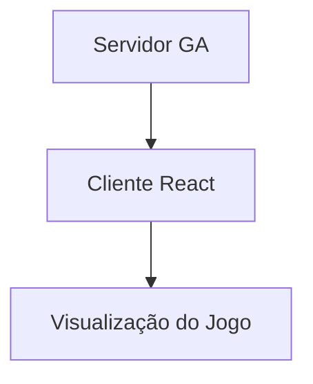

# Transmissão de Partidas em Tempo Real

Este documento explica como as partidas do jogo da cobrinha são transmitidas em tempo real do módulo de algoritmos genéticos (GA) para o frontend (FE), permitindo a visualização das partidas enquanto o treinamento ocorre.

## Arquitetura de Comunicação

A transmissão de partidas utiliza uma arquitetura cliente-servidor, onde:

- **Servidor (Backend GA)**: Executa as simulações de partidas e envia os estados do jogo
- **Cliente (Frontend React)**: Recebe os estados e renderiza a visualização

### Diagrama de Fluxo de Dados

